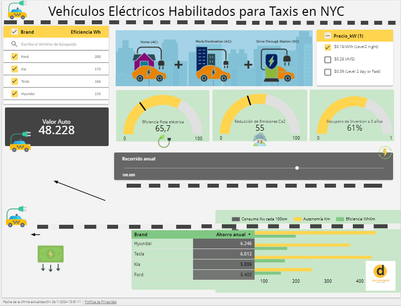

# <h1 align="center"> Dataminds Consulting</h1>

  

En Dataminds Consulting, nos dedicamos apasionadamente a desbloquear el potencial de los datos para ofrecer soluciones innovadoras y orientadas a resultados en el fascinante mundo de Data Science. Somos más que una consultora; somos arquitectos de soluciones analíticas que impulsan el éxito de tu empresa. 

<h2>¿Quiénes Somos?</h2>
Somos un equipo de expertos en Data Science con una visión clara: transformar datos en conocimiento y conocimiento en acción. En el corazón de Dataminds, fusionamos la experiencia técnica con la creatividad para resolver desafíos complejos y convertirlos en oportunidades para el crecimiento.  
 

Bienvenido a Dataminds Consulting, donde convertimos datos en inteligencia, y la inteligencia en acción. 
 

<h1 align="center">"EcoRide NYC: Transformando la Movilidad Urbana en Nueva York"</h1>

  

 

En la actualidad, los servicios de taxis y viajes compartidos en la ciudad de Nueva York han emergido como alternativas populares al transporte público. Estos servicios no solo proporcionan una valiosa fuente de datos sobre la ubicación de los vehículos, sino también información relevante sobre la calificación de los conductores, las ganancias diarias y mensuales de los taxis convencionales en diversos boroughs de la ciudad de Nueva York, así como la autonomía, eficiencia y costos asociados a los autos eléctricos. El análisis de estos datos puede ofrecer percepciones clave sobre los cambios en los patrones de viaje, particularmente en el contexto de la evolución postpandemia y la creciente adopción de modelos de trabajo flexibles.  

 

La motivación central de **ECORIDE** reside en la búsqueda de un enfoque más sostenible para sus operaciones. A través de la evaluación de la viabilidad de incorporar vehículos eléctricos, la empresa aspira a reducir significativamente su huella ambiental. Este análisis abordará no solo la eficiencia operativa de los vehículos eléctricos, sino también su impacto en la calidad del aire y la reducción de la contaminación sonora en el entorno urbano. 
 

<h2>DESAFÍOS Y OPORTUNIDADES</h2>

**ECORIDE,** se enfrenta a desafíos inherentes al análisis de datos complejos y diversos provenientes de los servicios de taxis en Nueva York. No obstante, estos desafíos ofrecen oportunidades significativas para la aplicación de tecnologías avanzadas de análisis de datos. La capacidad de abordar estos desafíos de manera efectiva permitirá a la empresa alinear su estrategia empresarial con los principios de sostenibilidad y responder a las cambiantes demandas del mercado con soluciones innovadoras y eficientes. 
 

<h2>OBJETIVO GENERAL</h2>

Desarrollar un análisis integral de datos y aplicar técnicas de Machine Learning para evaluar la viabilidad y el impacto de la incorporación de vehículos eléctricos en la flota, orientado a mejorar la sostenibilidad y eficiencia del transporte urbano. Este proyecto tiene como objetivo general proporcionar a una empresa de transporte de pasajeros de micros de media y larga distancia información clave sobre la posible transición a vehículos eléctricos, considerando aspectos como la reducción de la huella ambiental, el análisis de costos y ganancias, así como la implementación de estrategias sostenibles. 
 
<h2>OBJETIVOS ESPECÍFICOS</h2>

1. **Desarrollar un análisis detallado del mercado de taxis y viajes compartidos.** 
   Realizar un estudio exhaustivo del mercado actual de taxis y servicios de viajes compartidos en la ciudad de Nueva York, con especial atención en la identificación de tendencias, patrones de demanda, preferencias de los clientes y la estructura competitiva. Este análisis integral tiene como objetivo proporcionar una comprensión detallada del entorno de mercado, permitiendo así la identificación de oportunidades estratégicas y desafíos que puedan influir en la toma de decisiones en el ámbito del transporte urbano. 
   [Más Información](https://github.com/Chinaskidev/Dataminds-Consulting/tree/main/EDA_Preliminar) 

 

2. **Realizar un Análisis de Datos para Evaluar el Impacto Ambiental y Económico de Introducir Vehículos Eléctricos.** 
Aplicar metodologías avanzadas de análisis de datos para llevar a cabo una evaluación integral del impacto derivado de la incorporación de vehículos eléctricos en la flota existente. Este análisis abarcará la comparación detallada de emisiones de CO2, consumo energético y costos operativos entre vehículos eléctricos y sus contrapartes convencionales. Adicionalmente, se emplearán técnicas de **machine learning** para modelar diversos escenarios futuros, considerando diferentes niveles de adopción de vehículos eléctricos. Estos modelos permitirán prever los efectos a largo plazo tanto en términos de sostenibilidad ambiental como en la rentabilidad económica del proyecto. [Más Información](https://github.com/Chinaskidev/Dataminds-Consulting/tree/main/EDA_Final)  
 

3. **Desarrollar Modelos Predictivos de Machine Learning para Optimizar la Operación y Demanda del Servicio de Taxis.** 
El objetivo fundamental consiste en desarrollar modelos predictivos capaces de anticipar patrones de demanda, optimizar rutas y horarios, y perfeccionar la asignación de recursos. Estos modelos representarían herramientas fundamentales para la toma de decisiones basadas en datos, destinadas a potenciar la eficiencia operativa y elevar la calidad de la experiencia del cliente por parte de la empresa. [Más Información](https://github.com/Chinaskidev/Dataminds-Consulting/tree/main/Notebooks_ML) 
 

<h2>KPI´S ASOCIADOS</h2>

**Reducción Porcentual de Emisiones de CO2:** 
Objetivo: Calcular la reducción potencial de CO2 al implementar vehículos eléctricos 
 
Fórmula:  (EmisionesCO2vehiculoConvencional − EmisionesCO2vehiculoElectrico) / EmisionesCO2vehiculoConvencional × 100  
 
Meta: 	Alcanzar una reducción del 30% anual en las emisiones de CO2 por kilómetro con la introducción de vehículos eléctricos, en comparación con los vehículos convencionales. 
 
Bibliografía: 
New York State Energy Research and Development Authority (NYSERDA). 2022 “Projected Emission Factors for New York State Grid Electricity,” NYSERDA Report Number 22-18. Albany, NY. [Enlace a la Web](https://www.nyserda.ny.gov/File%20Not%20Found?item=%2fpublications&user=extranet%5cAnonymous&site=nyserda)  

  

