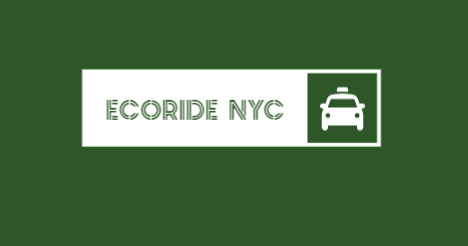

# <h1 align="center">ECORIDE NYC</h1>

  

El proyecto **ECORIDE** tiene como objetivo promover el uso del transporte ecológico en la ciudad de Nueva York. Nuestro enfoque principal es fomentar el uso de taxis eléctricos para reducir las emisiones de gases contaminantes y mejorar la calidad del aire en la ciudad. 

Mediante la implementación de una plataforma de reserva de taxis eléctricos compartidos, buscamos ofrecer a los ciudadanos una alternativa sostenible y eficiente de transporte. Además, proporcionamos información sobre rutas y horarios del transporte público para facilitar la planificación de viajes. 

ECORIDE se compromete a contribuir a la construcción de una ciudad más verde y amigable con el medio ambiente. Únete a nosotros en esta iniciativa y juntos hagamos de Nueva York un lugar más sostenible y saludable para vivir. 

¡Únete a la revolución de la movilidad ecológica con **ECORIDE**!

